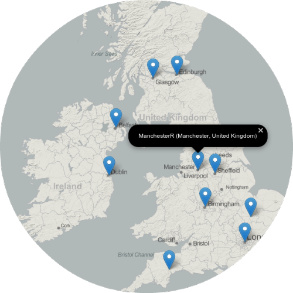

      
     
    

     

    
<h2>Maps of R User Groups Around the World</h2>

    

    by <a href="http://www.jofaichow.co.uk/" target="_blank">Jo-fai Chow</a>
    
 

    
    

    This app is author's submission to the visualization contest held by Revolution Analytics.
    The main goal is to create web-ready plots of R User Groups (RUGs) on a world map 
    as well as maps of Europe and United States. 
    All figures and tables can be generated using 
    <a href="http://www.r-project.org/" target="_blank"><i>R</i></a> 
    with packages such as <i>Shiny</i>, <i>rCharts</i>, <i>rMaps</i> and <i>ggmap</i>.
    Code will be made available to the public after the submission deadline.
    For contest rules and requirements, please read the <a href="http://blog.revolutionanalytics.com/2014/06/contest-prizes-for-best-r-user-groups-plot.html" target="_blank">
    original blog post by Joseph Rickert</a>.
    
 
    
    
<h3>Quick Start</h3>
    
    

    To begin with, check out the three required maps:
    

    <ol>
    <li><b>All RUGs on a world map</b> (<i>Navbar → Maps → All R User Groups</i>).</li>
    <li><b>RUGs on the map of Europe</b> (<i>Navbar → Maps → Europe</i>).</li>
    <li><b>RUGs on the map of United States</b> (<i>Navbar → Maps → United States</i>).</li>
    </ol> 
    
    
<h3>Additional Maps and Features</h3>

    <ol>
    <li>Maps of other regions are available.</li>
    <li>Maps of countries with at least five RUGs are also available.</li>
    <li>Navigation and zooming (all maps are interactive).</li>
    <li>More RUGs info (hover and click on the markers).</li>
    </ol> 
    
    
<h3>Data Collection and Preparation</h3>

    

    The RUGs data is based on a
    <a href="http://revolution-computing.typepad.com/files/RUGs_ww_june_11_14.csv" target="_blank">CSV</a>
    file provided by Revolution Analytics.
    Geographic coordinates (latitude/longitude) were added to the records.
    Some minor mistakes were also ironed out during the data preparation process. 
    Those errors include:
    

    <li>Misspelling (e.g. Chang Mai → Chiang Mai).</li>
    <li>Text Encoding Errors (e.g. Names in Spanish).</li>
    <li>Missing Entries (e.g. 'United States' was missing in Charlotte).</li>
    <li>Duplicate Records (e.g. Kansas City).</li> 
    
    
<h3>Acknowledgement</h3>

    
    
Thanks to <a href="https://github.com/ramnathv" target="_blank">Ramnath Vaidyanathan</a>'s
    <a href="http://rcharts.io/" target="_blank"><i>rCharts</i></a> and
    <a href="http://rmaps.github.io/" target="_blank"><i>rMaps</i></a>,
    R developers
    can leverage the power of JavaScripts libraries such as 
    <a href="http://leafletjs.com/" target="_blank"><i>Leaflet</i></a>
    for making interactive maps in R.

    
The
    <a href="http://www.rstudio.com/" target="_blank">RStudio team</a>
    has provided the community two very powerful tools: 
    <a href="http://shiny.rstudio.com/" target="_blank"><i>Shiny</i></a> and
    <a href="https://www.shinyapps.io/" target="_blank"><i>ShinyApps</i></a>.
    These tools allow R users to quickly develop and to host web applications.

    
    
The
    <a href="http://cran.r-project.org/web/packages/ggmap/index.html" target="_blank"><i>ggmap</i></a>
    package by 
    <a href="http://www.baylor.edu/statistics/index.php?id=83160" target="_blank">David Kahle</a>
    and 
    <a href="http://had.co.nz/" target="_blank">Hadley Wickham</a>
    streamlines many complex and time-consuming spatial analysis procedures in R.

    
     
    
    
<h3>License</h3>

    

    This app comes with the
    <a href="https://www.gnu.org/licenses/old-licenses/gpl-2.0.html" target="_blank">
    GNU General Public License (GPL) version 2 (#GPLv2)</a>.
    

